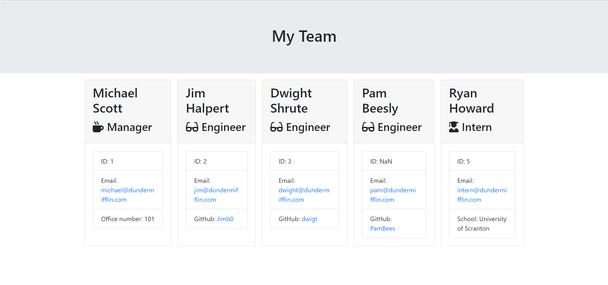

  # hw-week-ten
  
  ## Project Description

  This project is a simple team member generator utilizing back-end technologies including JavaScript, node.js, npm, Inquirer, and jest. After a quick installation, you can generate an HTML template with basic information for team members with the roles of Manager, Engineer, or Intern. This is accomplished by following the instructions in your terminal of chocie.

  ## Table of Contents

  [Installation](#installation)

  [Usage](#usage)

  [License](#license)

  [Contributing](#contributing)

  [Tests](#testing)
  
  [Questions/Contact](#questions)

  ## Installation
  
  *Note: node.js/NPM must be installed on your system for this program to function. You can find the respective downlaod here: https://nodejs.org/*

  Upon successful cloning/downloading of this repo, begin by navigating to the repository and running the following command in your terminal to download the necessary dependencies.

  ~~~
  npm i
  ~~~
  
  After the dependencies have been installed, navigate to the "Develop" directory like so.
  
  ~~~
  cd Develop/
  ~~~
  
  Once you have navigated to the "Develop" directory, run the following command to launch the program.
  
  ~~~
  node app.js
  ~~~

  ## Usage

  Download or clone this repo and install necessary dependencies (see Instructions for more details).

  ## License

  

  This project is registered under the MIT license.

  To learn more about this license, visit (https://choosealicense.com/licenses/mit/)

  ## Testing

  Navigate to the "Develop" directory (see Instructions for details) and run the following command in the terminal.

  ~~~
  npm test
  ~~~

  ## Questions

  If you have any questions, comments, or concerns about this project, you can reach me at the following links:
  
  Email: jaymanw2000@gmail.com
  
  GitHub: [JaymanW](https://github.com/JaymanW)
  
